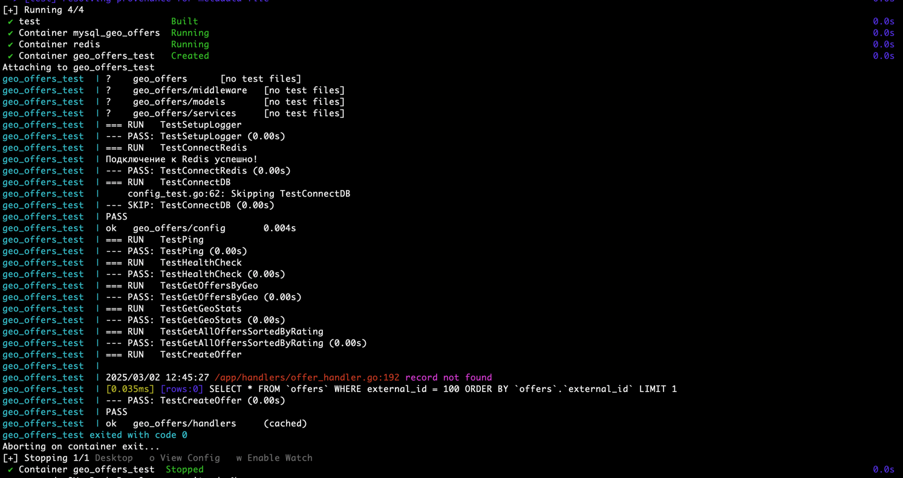

# CityAds Offers Service

Этот проект представляет собой **Go**‑приложение, которое:

1. Синхронизирует офферы из внешнего источника (CityAds API).
2. Сохраняет их в базе данных (MySQL).
3. Предоставляет **JSON API** для получения офферов по GEO и статистики по GEO.
4. Позволяет повторно синхронизировать офферы по запросу.

## Требования

- **Docker** и **docker compose** (версии не ниже 3).
- У вас должно быть достаточно свободных портов, указанных в `docker-compose.yml` для Go, MySQL, Redis, Prometheus, Grafana.

## Установка и запуск

1. **Склонируйте репозиторий**:

   ```bash
   git clone https://github.com/orhan17/go-cityads.git
   cd go-cityads
   ```

2. Скопируйте `.env.example` в `.env`:
   ```bash
   cp .env.example .env
   ```

3. **Сконфигурируйте переменные окружения** в `.env`, указав данные для MySQL и прочие настройки (например, `MYSQL_ROOT_PASSWORD`, `MYSQL_DATABASE`, `MYSQL_USER`, `MYSQL_PASSWORD` и т. д.).

4. **Соберите и запустите** контейнеры:

   ```bash
   docker compose down && docker compose up --build
   ```

5. **Убедитесь**, что контейнеры поднялись:

   ```bash
   docker compose ps
   ```

6. **Зайдите в браузере** по адресу `http://localhost:3000`. Должна открыться страница вашего Go‑приложения (или 404, если нет дефолтного роутинга).

## Миграции БД

В проекте используется Gorm Migrations.

## Тестирование (Go Testify)

1. **Запуск тестов**:
   ```bash
   docker compose up --build --exit-code-from test --abort-on-container-exit test
   ```


**Приятного использования!**

### 📩 Обратная связь
Если у вас возникли вопросы или проблемы, пишите в мой Telegram-канал: [@ahmedovorxan](https://t.me/ahmedovorxan)